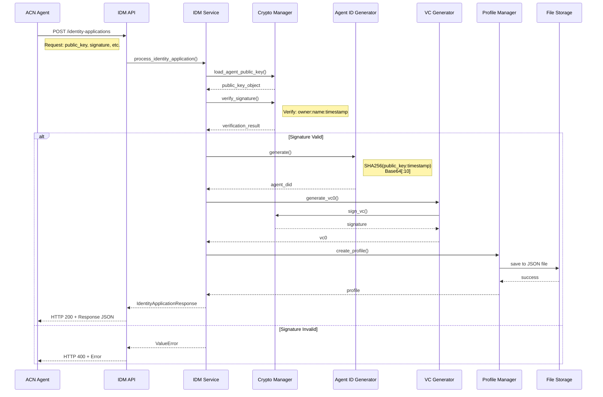

# API接口文档

## 概述

IDM服务提供RESTful API接口，用于ACN Agent的身份管理。

**基础URL**: `http://localhost:9020`

**内容类型**: `application/json`

---

## 接口列表

### 1. 申请Agent身份

为ACN Agent颁发DID身份和VC0证书。

**端点**

```
POST /idm/v1/identity-applications
```

**请求头**

```http
Content-Type: application/json
```

**请求体**

| 字段 | 类型 | 必填 | 描述 |
|------|------|------|------|
| owner | string | 是 | Agent所有者标识 |
| name | string | 是 | Agent名称 |
| public_key | string | 是 | Agent公钥（PEM格式） |
| description | string | 是 | Agent描述 |
| timestamp | integer | 是 | 申请时间戳（Unix时间戳） |
| signature | string | 是 | 签名值（Base64编码） |
| signature_encoding | string | 是 | 签名编码格式，如"base64" |
| metadata | object | 是 | 元数据信息 |
| metadata.region | string | 是 | 地区 |
| metadata.os | string | 是 | 操作系统 |
| metadata.version | string | 是 | 版本号 |

**请求示例**

```json
{
    "owner": "Alice",
    "name": "AliceAgent",
    "public_key": "-----BEGIN PUBLIC KEY-----\nMIIBIjANBgkqhkiG9w0BAQEFAAOCAQ8AMIIBCgKCAQEAyZ2Q...\n-----END PUBLIC KEY-----",
    "description": "Alice's personal assistant, Model-X",
    "timestamp": 1711185600,
    "signature": "base64_encoded_signature_string",
    "signature_encoding": "base64",
    "metadata": {
        "region": "CN",
        "os": "Linux",
        "version": "1.0.0"
    }
}
```

**签名算法**

签名字符串构造：
```
message = owner + ":" + name + ":" + timestamp
```

签名使用Agent私钥，ECDSA + SHA-256 算法，结果Base64编码。

**响应**

成功响应（HTTP 200）:

```json
{
    "result": "success",
    "agent_id": "did:acn:aB3dE5fG7h",
    "vc0": {
        "context": ["3gpp-ts-33.xxx-v20.0.0"],
        "id": "CMCC/credentials/3732",
        "type": ["VerifiableCredential", "BindingSIMCredential"],
        "issuer": "did:udid:idm@6gc.mnc015.mcc234.3gppnetwork.org",
        "valid_from": "2024-01-01T00:00:00Z",
        "valid_until": "2025-01-01T00:00:00Z",
        "claims": {
            "agent_name": "AliceAgent",
            "agent_id": "did:udid:type2.rid678.achid0.uerid1368888888800123@6gc.mnc015.mcc234.3gppnetwork.org",
            "agent_attribute": "运营商颁发，Agent与主UE的绑定关系，用于对外出示，审计确权",
            "master_id": "type0.rid678.schid0.userid1userid20001@6gc0001@6gc.mnc015.mcc234.3gppnetwork.org",
            "self_id": "type0.rid678.schid0..mnc015.mcc234.3gppnetwork.org"
        },
        "proof": {
            "creator": "did:udid:idm@6gc.mnc015.mcc234.3gppnetwork.org#keys-1",
            "signature_value": "base64_encoded_signature"
        }
    }
}
```

| 字段 | 类型 | 描述 |
|------|------|------|
| result | string | 处理结果，"success"表示成功 |
| agent_id | string | 生成的Agent DID |
| vc0 | object | VC0证书 |
| vc0.context | array | 上下文标识 |
| vc0.id | string | VC唯一标识 |
| vc0.type | array | VC类型 |
| vc0.issuer | string | 颁发者DID |
| vc0.valid_from | string | 生效时间（ISO 8601） |
| vc0.valid_until | string | 过期时间（ISO 8601） |
| vc0.claims | object | 声明内容 |
| vc0.claims.agent_name | string | Agent名称 |
| vc0.claims.agent_id | string | Agent DID |
| vc0.claims.agent_attribute | string | Agent属性描述 |
| vc0.claims.master_id | string | 主UE身份标识 |
| vc0.claims.self_id | string | Agent SIM卡标识 |
| vc0.proof | object | 证明信息 |
| vc0.proof.creator | string | 签名者DID |
| vc0.proof.signature_value | string | 签名值（Base64） |

错误响应（HTTP 400/500）:

```json
{
    "detail": "Error message"
}
```

---

### 2. 健康检查

检查IDM服务运行状态。

**端点**

```
GET /idm/v1/health
```

**响应**

成功响应（HTTP 200）:

```json
{
    "status": "healthy",
    "service": "IDM",
    "did": "did:udid:idm@6gc.mnc015.mcc234.3gppnetwork.org"
}
```

| 字段 | 类型 | 描述 |
|------|------|------|
| status | string | 服务状态，"healthy"表示正常 |
| service | string | 服务名称 |
| did | string | IDM的DID标识 |

---

### 3. 列出所有Agent

获取所有已注册Agent的ID列表。

**端点**

```
GET /idm/v1/profiles
```

**响应**

成功响应（HTTP 200）:

```json
{
    "agent_ids": [
        "did:acn:abc123",
        "did:acn:def456"
    ],
    "count": 2
}
```

| 字段 | 类型 | 描述 |
|------|------|------|
| agent_ids | array | Agent ID列表 |
| count | integer | Agent数量 |

---

### 4. 获取Agent Profile

获取指定Agent的详细Profile信息。

**端点**

```
GET /idm/v1/profiles/{agent_id}
```

**路径参数**

| 参数 | 类型 | 必填 | 描述 |
|------|------|------|------|
| agent_id | string | 是 | Agent DID |

**响应**

成功响应（HTTP 200）:

```json
{
    "agent_id": "did:acn:aB3dE5fG7h",
    "controller": "type0.rid678.schid0.userid1userid20001@6gc0001@6gc.mnc015.mcc234.3gppnetwork.org",
    "verification_relationships": [
        {
            "id": "did:acn:aB3dE5fG7h#key1",
            "type": "JsonWebKey",
            "controller": "aB3dE5fG7h",
            "publicKeyJwk": {
                "crv": "Ed25519",
                "x": "VCpo2LMLhn6iWku8MKvSLg2ZAoC-nlOyPVQaO3FxVeQ",
                "kty": "OKP",
                "kid": "_Qq0UL2Fq651Q0Fjd6TvnYE-faHiOpRlPVQcY_-tA4A"
            }
        }
    ],
    "vc0": {
        "context": ["3gpp-ts-33.xxx-v20.0.0"],
        "id": "CMCC/credentials/3732",
        "type": ["VerifiableCredential", "BindingSIMCredential"],
        "issuer": "did:udid:idm@6gc.mnc015.mcc234.3gppnetwork.org",
        "valid_from": "2024-01-01T00:00:00Z",
        "valid_until": "2025-01-01T00:00:00Z",
        "claims": {
            "agent_name": "AliceAgent",
            "agent_id": "did:udid:type2.rid678.achid0.uerid1368888888800123@6gc.mnc015.mcc234.3gppnetwork.org",
            "agent_attribute": "运营商颁发，Agent与主UE的绑定关系，用于对外出示，审计确权",
            "master_id": "type0.rid678.schid0.userid1userid20001@6gc0001@6gc.mnc015.mcc234.3gppnetwork.org",
            "self_id": "type0.rid678.schid0..mnc015.mcc234.3gppnetwork.org"
        },
        "proof": {
            "creator": "did:udid:idm@6gc.mnc015.mcc234.3gppnetwork.org#keys-1",
            "signature_value": "uill9900"
        }
    },
    "vc0_authorization_mode": "Authorizationtemplate ID1",
    "created_at": "2024-01-01T00:00:00Z",
    "updated_at": "2024-01-01T00:00:00Z"
}
```

错误响应（HTTP 404）:

```json
{
    "detail": "Profile not found"
}
```

---

## 时序图

### 身份申请完整流程



---

## 错误码

| HTTP状态码 | 含义 | 说明 |
|------------|------|------|
| 200 | OK | 请求成功 |
| 400 | Bad Request | 请求参数错误，如签名验证失败 |
| 404 | Not Found | 资源不存在 |
| 500 | Internal Server Error | 服务器内部错误 |

---

## 测试示例

### 使用curl测试

```bash
# 1. 健康检查
curl http://localhost:9020/idm/v1/health

# 2. 申请身份（需要先准备好签名）
curl -X POST http://localhost:9020/idm/v1/identity-applications \
  -H "Content-Type: application/json" \
  -d @request.json

# 3. 列出所有Agent
curl http://localhost:9020/idm/v1/profiles

# 4. 获取特定Agent Profile
curl http://localhost:9020/idm/v1/profiles/did:acn:abc123
```

### 使用Python测试

```python
import requests
import json

# 基础配置
BASE_URL = "http://localhost:9020"

# 健康检查
response = requests.get(f"{BASE_URL}/idm/v1/health")
print(response.json())

# 申请身份（需要先构造签名）
payload = {
    "owner": "test_owner",
    "name": "TestAgent",
    "public_key": "...",
    "description": "Test",
    "timestamp": 1711185600,
    "signature": "...",
    "signature_encoding": "base64",
    "metadata": {
        "region": "CN",
        "os": "Linux",
        "version": "1.0.0"
    }
}
response = requests.post(
    f"{BASE_URL}/idm/v1/identity-applications",
    json=payload
)
print(json.dumps(response.json(), indent=2))
```

---

## 版本历史

| 版本 | 日期 | 变更 |
|------|------|------|
| 1.0.0 | 2024-01 | 初始版本 |
