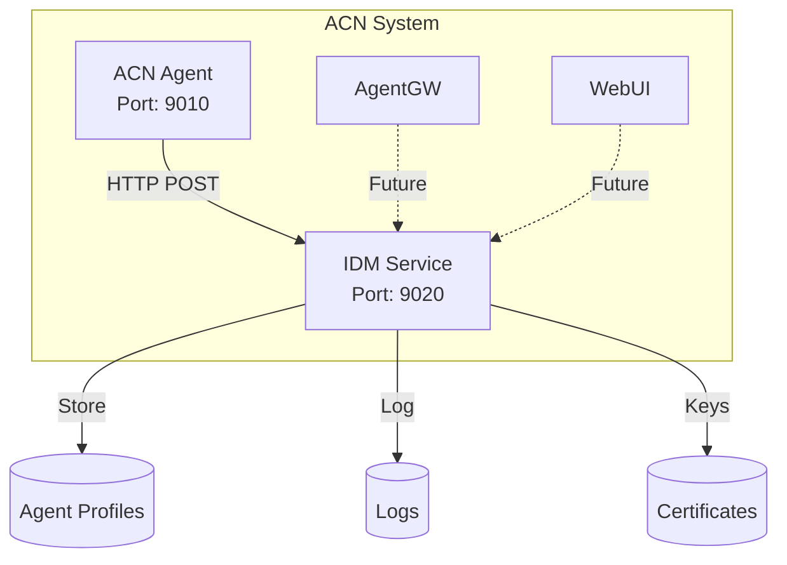
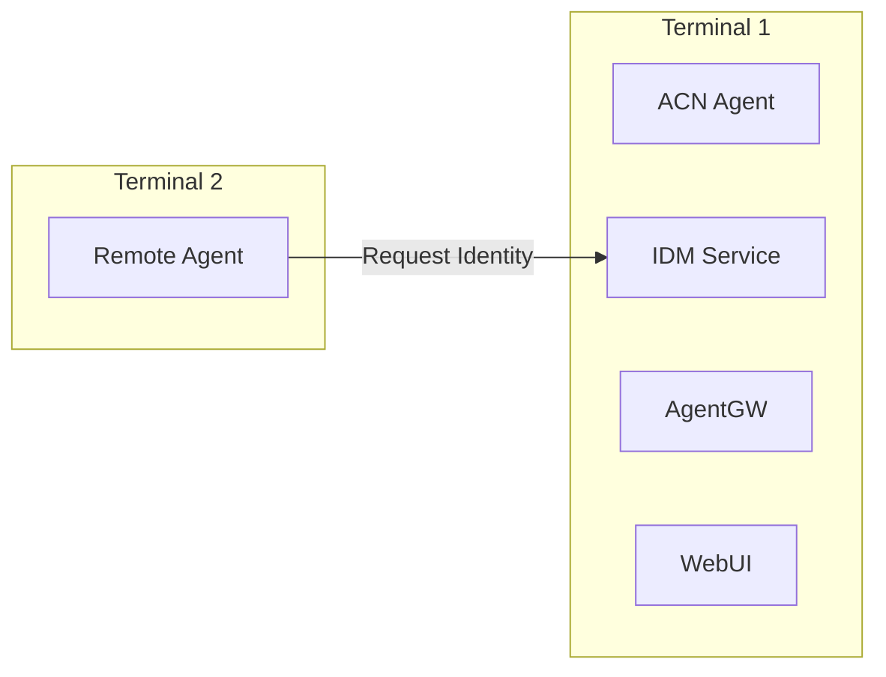
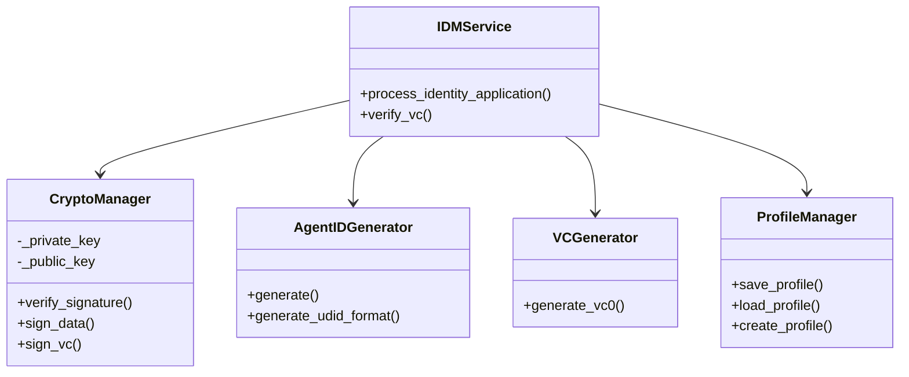
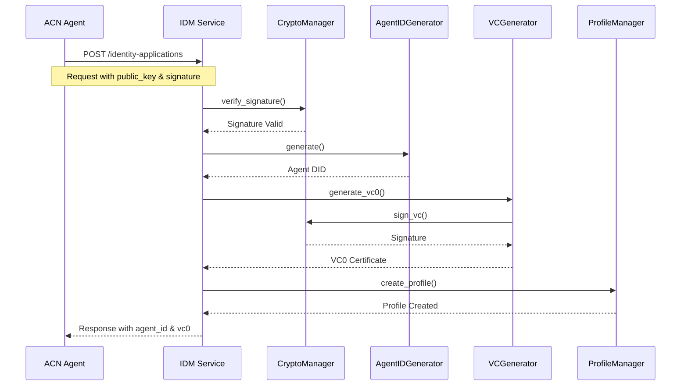
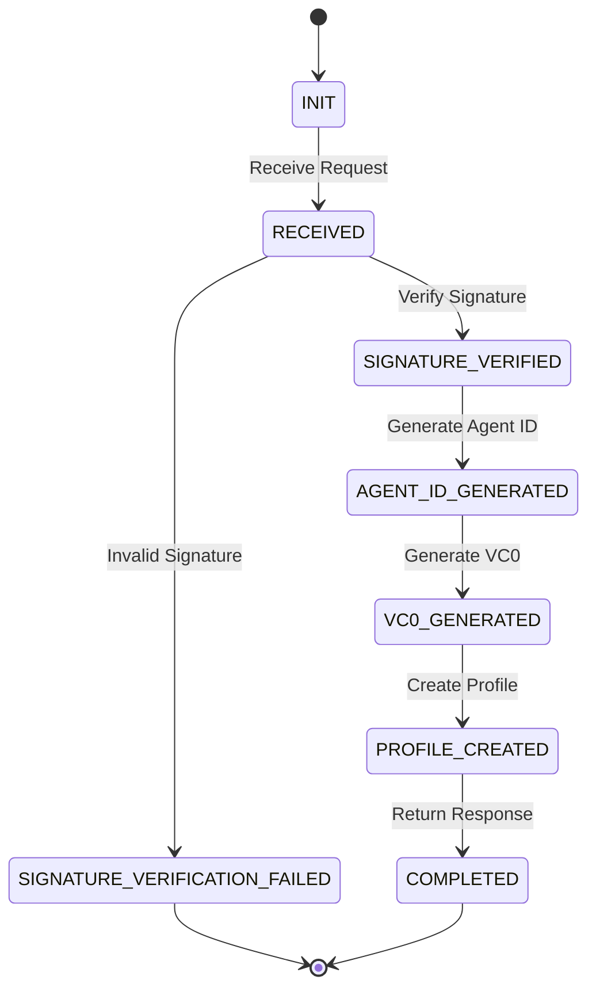
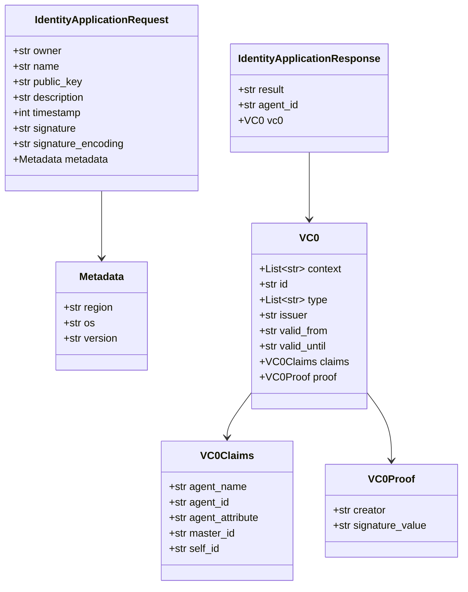
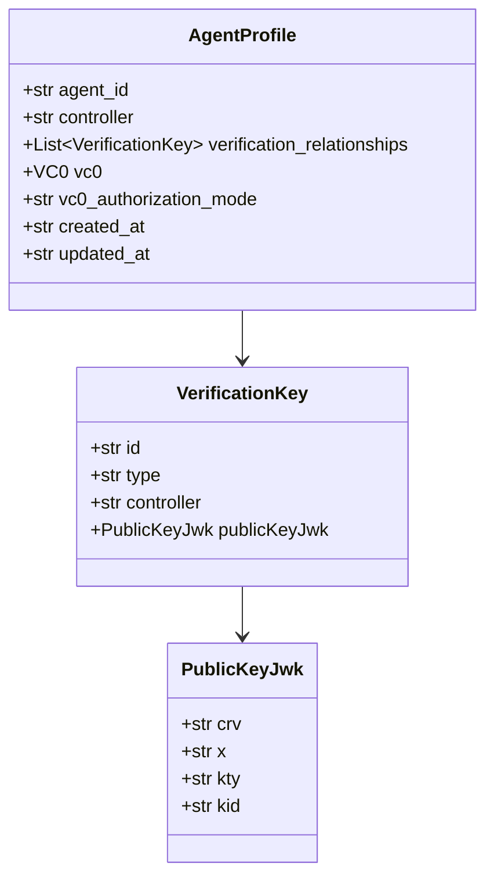

# 系统架构设计文档

## 1. 系统概述

### 1.1 架构图



### 1.2 部署架构



## 2. 组件说明

### 2.1 IDM服务组件



## 3. 业务流程

### 3.1 身份申请流程



### 3.2 状态转换图



## 4. 数据模型

### 4.1 请求/响应模型



### 4.2 Agent Profile模型



## 5. 目录结构

```
idm-acn/
├── src/
│   ├── idm/                    # 核心业务逻辑
│   │   ├── config.py           # 配置管理
│   │   ├── logger.py           # 日志配置
│   │   ├── models.py           # Pydantic模型定义
│   │   ├── crypto.py           # 加密签名模块
│   │   ├── agent_id.py         # Agent ID生成
│   │   ├── vc_generator.py     # VC生成
│   │   ├── profile_manager.py  # Profile管理
│   │   ├── idm_service.py      # 业务服务
│   │   └── main.py             # FastAPI入口
│   └── tests/                  # 测试模块
├── docs/                       # 文档
├── profiles/                   # Agent数据存储
├── logs/                       # 日志文件
├── certs/                      # IDM密钥证书
└── requirements.txt            # 依赖包
```

## 6. 关键算法

### 6.1 Agent ID生成算法

```python
# 算法描述
1. 接收: public_key (PEM格式), timestamp
2. 构造: salted_key = public_key + ":" + timestamp
3. 哈希: hash = SHA256(salted_key)
4. 编码: hash_b64 = Base64URL(hash)
5. 截取: short_hash = hash_b64[:10]
6. 返回: "did:acn:" + short_hash
```

特点：
- 同一公钥不同时间生成不同ID
- hash部分控制在10位以内
- URL安全的Base64编码

### 6.2 签名验证流程

```python
# 签名消息构造
message = f"{owner}:{name}:{timestamp}"

# 验证
public_key.verify(
    signature_bytes,
    message.encode(),
    ec.ECDSA(hashes.SHA256())
)
```

### 6.3 VC签名算法

```python
# 待签内容（排除proof部分）
vc_to_sign = {
    "context": vc["context"],
    "id": vc["id"],
    "type": vc["type"],
    "issuer": vc["issuer"],
    "valid_from": vc["valid_from"],
    "valid_until": vc["valid_until"],
    "claims": vc["claims"]
}

# 序列化后签名
message = json.dumps(vc_to_sign, sort_keys=True)
signature = IDM_private_key.sign(message)
```

## 7. 安全考虑

### 7.1 密钥管理

- IDM私钥存储在本地文件系统
- 使用PEM格式，PKCS#8编码
- 私钥文件权限应设置为600（仅所有者可读写）

### 7.2 签名验证

- 使用ECDSA P-256 + SHA256
- Base64编码的DER签名值
- 严格验证签名时间戳有效性

### 7.3 数据存储

- Agent Profile以JSON格式存储
- 每个Agent独立文件
- 文件名使用安全的编码转换

## 8. 扩展性设计

### 8.1 模块化设计

- 各功能模块独立（crypto, agent_id, vc, profile）
- 通过接口交互，便于替换实现
- 依赖注入模式

### 8.2 配置化

- 支持环境变量配置
- 可配置的DID前缀
- 可调整的VC有效期

### 8.3 日志记录

- 结构化日志
- 关键状态转换记录
- 完整的请求/响应追踪

## 9. 部署建议

### 9.1 生产环境

- 使用HTTPS/TLS
- 配置反向代理（Nginx）
- 设置日志轮转
- 监控服务健康状态

### 9.2 开发环境

- 使用 `--reload` 模式
- 开启DEBUG日志级别
- 本地测试使用Mock Agent
